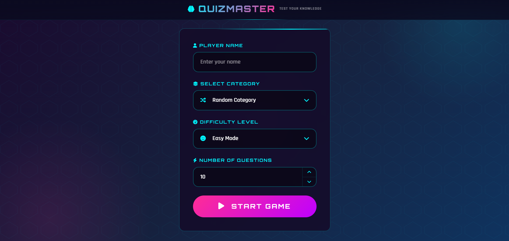

# 🧠 QuizMaster – The Ultimate Trivia Challenge


[(https://tarekhamdy99.github.io/Quiz-Master/))

**QuizMaster** is an engaging and interactive web-based trivia application built using Object-Oriented Programming (OOP) principles in Vanilla JavaScript. The application dynamically fetches real-time, diverse questions from the global Open Trivia DB API to deliver an exciting gaming experience, complete with a countdown round timer, a persistent local leaderboard, and a robust keyboard-supported error handling system.


_Add a screenshot of the application here_

---

## ✨ Key Features

| Feature               | Description                                                                              |
| :-------------------- | :--------------------------------------------------------------------------------------- |
| **Custom Setup**      | Select your favorite category (Tech, Science, Sports, History) and adjust difficulty.    |
| **Dynamic Timer**     | Face a 30-second ticking clock per question with visual flashing warning states.         |
| **Keyboard Controls** | Answer instantly using your keyboard keys (`1`, `2`, `3`, `4`) for faster interactions.  |
| **Local Leaderboard** | Tracks and updates the top 10 high scores locally, saving your best accuracy records.    |
| **Bulletproof UX**    | Built-in custom Tailwind error popups and loading skeleton animations for network drops. |

---

## 🛠️ Technologies Used


- **Frontend UI:** HTML5, Custom CSS3 Neon Theme, Tailwind CSS (For dynamic alerts)
- **Logic Engine:** Vanilla JavaScript (ES6+), Object-Oriented Programming (OOP) Modules
- **Icons:** Font Awesome 6 Pro
- **Data Source:** Open Trivia Database API (`https://opentdb.com`)

---

## 🚀 Live Demo

Experience the trivia live: [QuizMaster Demo](https://tarekhamdy99.github.io/QuizMaster/)

---

## 📂 Project Structure

```

QuizMaster/
│
├── CSS/
│   └── style.css           # Custom neon/cyberpunk Stylesheet layout
├── images/
│   └── favicon.png         # Game branding icon assets
├── js/
│   ├── index.js            # Main application bootstrap & form validator
│   ├── quiz.js             # Quiz state machine & localStorage tracking
│   ├── question.js         # Question renderer, countdown clock & bindings
│   ├── popup.js            # Tailwind error modal controller UI
│   └── ui-controls.js      # Custom dropdown selectors & stepper handlers
└── index.html              # Core HTML structure application entry point


```

---

## ⚙️ Implementation Details

### Object-Oriented Architecture

The application splits production business logic cleanly into separate ES6 modules:

- **`Quiz` Class**: Manages game configuration URLs, scores, leaderboard data states, and `localStorage` saves.
- **`Question` Class**: Handles structural DOM generation, HTML string entity decoding via `DOMParser`, interval timers, and user click/keypress listeners.

### Smart API Queries & Safety fallback

The system builds dynamic fetch strings natively. If a user queries a combination that contains insufficient questions, the application safely triggers custom modular error templates instead of crashing the view context.

---

## 🧠 Key Takeaways

This project showcases:

- Modular JavaScript architecture with strict separation of concerns.
- Advanced event lifecycles (handling keydown events and clearing intervals memory leaks).
- Dynamic layout injection and client-side storage persistence (`localStorage`).

---

## 📄 License

This project is open‑source and available for learning purposes. Feel free to use and modify it as needed.

---

## 👤 Author

**Tarek Hamdy Arafa**

[](https://github.com/tarekhamdy99)

---

⭐ **If you find this project helpful, consider giving it a star on GitHub!**
